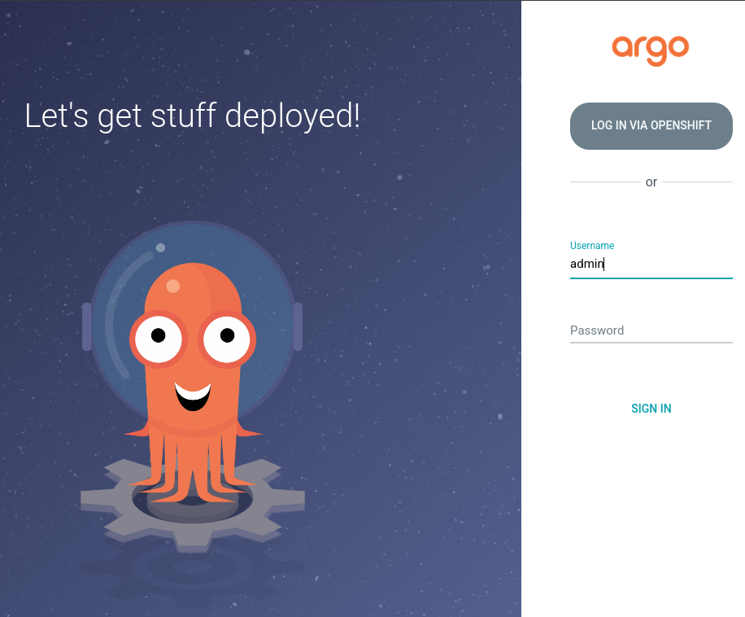
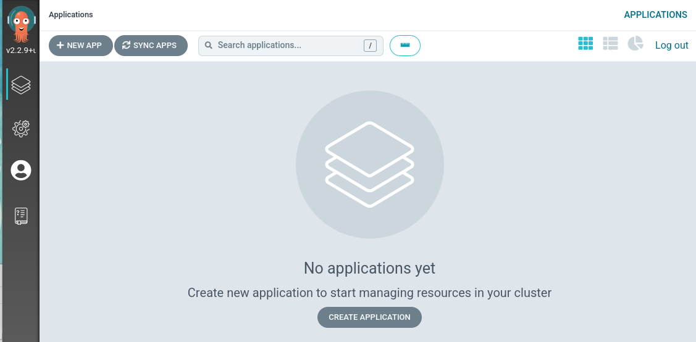
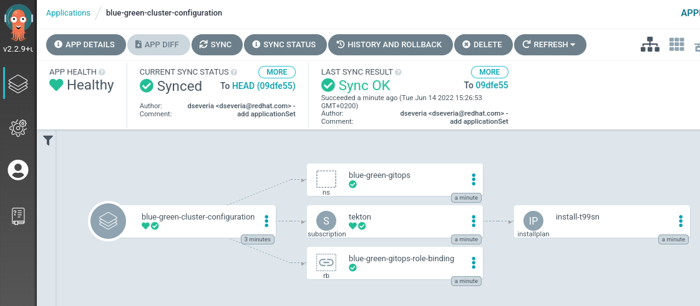

# Cloud Native Blue/Green

## Blue/Green Deployment

Blue green deployment is an application release model that gradually transfers user traffic from a previous version of an app or microservice to a nearly identical new release—both of which are running in production.
The old version can be called the blue environment while the new version can be known as the green environment. Once production traffic is fully transferred from blue to green, blue can standby in case of rollback or pulled from production and updated to become the template upon which the next update is made.

To achive this with `Cloud Native` applications we have designe this model:


## Shop application

We are going to use very simple applications to test Blue/Green deployment. We have create two Quarkus applications `Products` and `Discounts`


`Products` expose an API with a list of products and call `Discounts` to get the discounts of the products

### Shop Blue/Green

This is the architecture that we have difine t


## OpenShift GitOps 
### Install OpenShift GitOps 

Log into OpenShift as a cluster admin and install the OpenShift GitOps operator with the following command:
```
oc apply -f gitops/gitops-operator.yaml
TODO ver si puedo meter aqui tambin la aplicaicon de argo y que todo sea solo este comando
```

Once OpenShift GitOps is installed, an instance of Argo CD is automatically installed on the cluster in the `openshift-gitops` namespace and link to this instance is added to the application launcher in OpenShift Web Console.


### Log into Argo CD dashboard

Argo CD upon installation generates an initial admin password which is stored in a Kubernetes secret. In order to retrieve this password, run the following command to decrypt the admin password:

```
oc extract secret/openshift-gitops-cluster -n openshift-gitops --to=-
```

Click on Argo CD from the OpenShift Web Console application launcher and then log into Argo CD with `admin` username and the password retrieved from the previous step.





### Configure OpenShift with Argo CD

In the current Git repository, the [gitops/cluster-config](gitops/cluster-config/) directory contains OpenShift cluster configurations such as:
- namespaces `blue-green-gitops`.
- operator `Openshift Pipelines`.
- cluster role `tekton-admin-view`.
- role binding for ArgoCD to the namespace `blue-green-gitops`.
- `pipelines-blue-green` the pipelines that we will see later for blue/green deployment.
- `shop-blue-green` the application that we are going to use to test blue/green deployment


 Let's configure Argo CD to recursively sync the content of the [gitops/cluster-config](gitops/cluster-config/) directory to the OpenShift cluster.

Execute this command to add a new Argo CD application that syncs a Git repository containing cluster configurations with the OpenShift cluster.

```
oc apply -f gitops/application-cluster-config.yaml -n openshift-gitops
```

Looking at the Argo CD dashboard, you would notice that three applications has been created. 


You can click on the **blue-green-cluster-configuration** application to check the details of sync resources and their status on the cluster. 




You can check that a namespace called `blue-green-gitops` is created on the cluster.

You can check that the **Openshift Pipelines operator** is installed.

And also the other to applications has been created **pipelines-blue-green** **shop-blue-green**


We have to get the Online and the Offline routes
```
oc get routes -n blue-green-gitops
```
TODO poner como probar que shop funciona


export TOKEN=XXXXXX
export GIT_USER=YYY
oc policy add-role-to-user edit system:serviceaccount:blue-green-gitops:pipeline --rolebinding-name=pipeline-edit -n blue-green-gitops
oc create secret generic github-token --from-literal=username=${GIT_USER} --from-literal=password=${TOKEN} --type "kubernetes.io/basic-auth" -n blue-green-gitops
oc annotate secret github-token "tekton.dev/git-0=https://github.com/davidseve" -n blue-green-gitops
oc secrets link pipeline github-token -n blue-green-gitops
tkn hub install task helm-upgrade-from-source -n blue-green-gitops
tkn hub install task kaniko -n blue-green-gitops
tkn hub install task git-cli -n blue-green-gitops
kubectl apply -f https://raw.githubusercontent.com/tektoncd/catalog/main/task/openshift-client/0.2/openshift-client.yaml -n blue-green-gitops

TODO lanzar los pipelines
TODO poner su usuario de github
oc create -f 1-pipelinerun-products-new-version.yaml -n blue-green-gitops
oc create -f 2-pipelinerun-products-configuration.yaml -n blue-green-gitops
oc create -f 3-pipelinerun-products-scale-up.yaml -n blue-green-gitops
oc create -f 4-pipelinerun-products-switch.yaml -n blue-green-gitops


TODO borrar
borrar todas las aplicaciones desde la web de Argo
borra los operadoes de pipelienes y gitops desde la web de openshift

