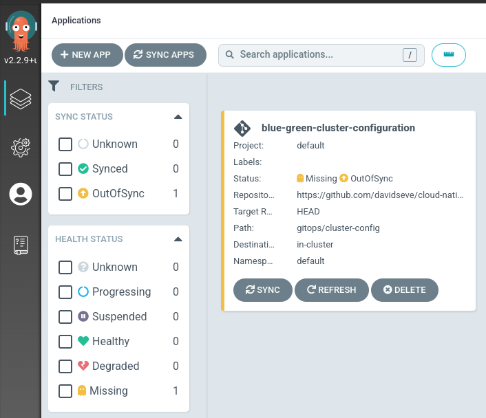

# Cloud Native Blue/Green

## OpenShift GitOps 
### Install OpenShift GitOps 

Log into OpenShift as a cluster admin and install the OpenShift GitOps operator with the following command:
```
oc apply -f gitops/gitops-operator.yaml
TODO ver si puedo meter aqui tambin la aplicaicon de argo y que todo sea solo este comando
```

Once OpenShift GitOps is installed, an instance of Argo CD is automatically installed on the cluster in the `openshift-gitops` namespace and link to this instance is added to the application launcher in OpenShift Web Console.


### Log into Argo CD dashboard

Argo CD upon installation generates an initial admin password which is stored in a Kubernetes secret. In order to retrieve this password, run the following command to decrypt the admin password:

```
oc extract secret/openshift-gitops-cluster -n openshift-gitops --to=-
```

Click on Argo CD from the OpenShift Web Console application launcher and then log into Argo CD with `admin` username and the password retrieved from the previous step.


### Configure OpenShift with Argo CD

In the current Git repository, the [gitops/cluster-config](gitops/cluster-config/) directory contains OpenShift cluster configurations such as namespaces that should be created. Let's configure Argo CD to recursively sync the content of the [gitops/cluster-config](gitops/cluster-config/) directory to the OpenShift cluster. Initially, we can set the sync policy to manual in order to be able to review changes before rolling out configurations to the cluster. 

Execute this command to add a new Argo CD application that syncs a Git repository containing cluster configurations with the OpenShift cluster.

```
oc apply -f gitops/application-cluster-config.yaml -n openshift-gitops
```

Looking at the Argo CD dashboard, you would notice that the **blue-green-cluster-configuration** Argo CD application is created by is out of sync, since we configured it with manual sync policy.



Click on the **Sync** button on the **blue-green-cluster-configuration** application and then on **Synchronize** button after reviewing the changes that will be rolled out to the cluster.

Once the sync is completed successfully, you would see that Argo CD reports a the configurations to be currently in sync with the Git repository and healthy. You can click on the **blue-green-cluster-configuration** application to check the details of sync resources and their status on the cluster. 


You can check that a namespace called `blue-green-gitops` is created on the cluster.

You can also check that the **Openshift Pipelines operator** is installed.

Now that the configuration sync is in place, any changes in the Git repository will be automatically detect by Argo CD and would change the status of the **blue-green-cluster-configuration** to `OutOfSync`, which implies a drift from the desired configuration. One can set the [sync policy to automated](https://argo-cd.readthedocs.io/en/stable/user-guide/auto_sync/) in order for Argo CD to automatically roll out changes form Git repository to the cluster. 

TODO ver si faltan mas permisos


TODO ver si faltan mas permisos, casi seguro que el toke de git
